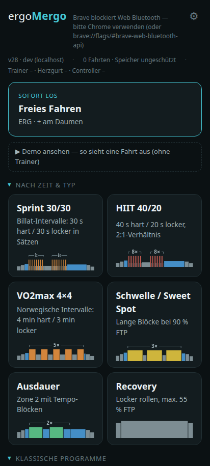
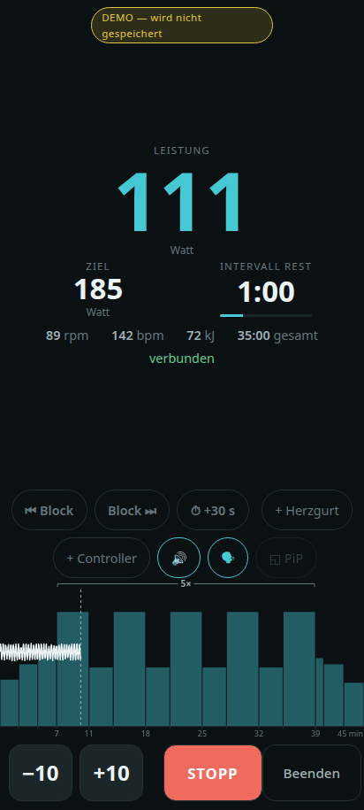
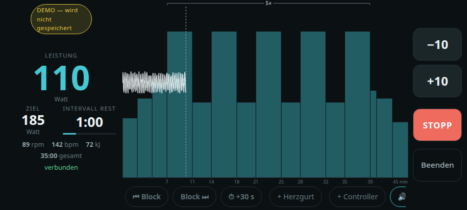

# ergoMergo

**Zwei Taps bis zum Treten.** ergoMergo macht aus einem Wahoo KICKR (oder jedem
FTMS-Smarttrainer) ein wattgesteuertes Ergometer — direkt im Browser, ohne Zwift,
ohne Abo, ohne Konto, ohne virtuelle Welt. Trainer per Bluetooth verbinden,
Programm oder Wattzahl wählen, fahren.

**Live:** https://grenzenloseschublade.github.io/ergoMergo/

  

## Datenschutz

**Alle Daten bleiben auf dem Gerät.** Fahrten, Einstellungen und Programme
liegen ausschließlich in der lokalen IndexedDB des Browsers — es gibt keinen
Server, kein Konto, keine Cloud, keine Telemetrie, keine Cookies und keine
Drittanbieter-Anfragen. Die App ist eine rein statische Seite; nach dem ersten
Laden funktioniert sie komplett offline. Export (Backup/TCX) passiert nur auf
ausdrücklichen Tap und landet als Datei auf dem eigenen Gerät.

## Warum

Wer nur strukturiert Watt treten will, braucht keine 3D-Welt, kein Monatsabo und
keinen Account. Was fehlte: eine App, die den Trainer ansteuert wie ein
Studio-Ergometer — Ziel-Watt, Intervalle, ±-Tasten am Lenker, Auswertung.
ergoMergo ist genau das: eine einzige statische Web-App (Vanilla JS, Web
Bluetooth/FTMS, keine Buildkette, kein Backend), alle Daten bleiben lokal auf
dem Gerät.

| | |
|---|---|
|  |  |



## Features

| Bereich | Was drin ist |
|---|---|
| ERG-Steuerung | Ziel-Watt mit sanften Rampen, ±-Tasten (Touch, Tastatur, Zwift Click/Ride), Not-Stopp mit geschütztem WEITER |
| Programme | Zeitbasierte Generatoren (Sprint 30/30, HIIT 40/20, VO2max 4×4, Schwelle, Ausdauer, Recovery), klassische Programme, FTP-Rampentest, `.zwo`-Import |
| Fahrbildschirm | Live-Graph mit Programmprofil und Positionscursor, Blocksteuerung (überspringen/zurück/+30 s), Kadenz-Zielbereiche, Large-Print-Modus, Bild-in-Bild (Experiment) |
| Ansagen & Töne | Blockwechsel-Signale und Sprachansagen aus vorgerenderten Audio-Bausteinen — funktionieren auch mit Bildschirm aus |
| Geräte | Trainer, Herzfrequenz-Gurt, Zwift Click/Ride; Tasten frei belegbar per Lern-Modus; Schnellverbindung ohne Geräteauswahl (mit Chrome-Flag) |
| Auswertung | Dauer, Ø/max/NP, IF/TSS, HF, Zeit in Zonen, Soll/Ist-Vergleich pro Block, Wochenbilanz, TCX-Export, Akkuverbrauch pro Fahrt |
| Plattform | Installierbare PWA, offlinefähig, alles lokal in IndexedDB — kein Server, keine Cloud |

## Getestet mit

| Gerät | Firmware/Version |
|---|---|
| Wahoo KICKR CORE 2 | FW 3.5.37 |
| Zwift Ride (Lenker) | FC82-Firmware (ab Jan 2025), Lern-Modus für Tastenbelegung |
| Samsung-Smartphone, Android-Chrome | Primärziel (Handy am Lenker) |
| Ubuntu-Laptop, Chrome | Sekundärziel |

Jeder FTMS-Trainer sollte funktionieren (Standard-Protokoll); getestet ist die
Kombination oben. iOS wird nicht unterstützt (kein Web Bluetooth in Safari).

## Nutzung

- **Android:** Seite öffnen bzw. als App installieren, Trainer auswählen, fahren.
  Den Trainer **nicht** vorab in den Android-Bluetooth-Einstellungen koppeln —
  das blockiert die Verbindung aus der App.
- **Linux:** Web Bluetooth hinter Flag: `chrome://flags/#enable-web-bluetooth`
  aktivieren. Scheitert das Pairing, den Trainer einmalig per `bluetoothctl`
  koppeln (`pair` + `trust`).
- Optional überall: `chrome://flags/#enable-web-bluetooth-new-permissions-backend`
  erspart die Geräteauswahl bei jedem Start (Schnellverbindung).

## Workouts nach Zeit & Typ

Dauer und Trainingstyp wählen — die App generiert ein vollständiges Programm mit
Warmup-Rampe, skaliertem Hauptteil und Cooldown. Intensitäten sind fix (%FTP),
die Zeit skaliert über Wiederholungen und Z2-Füller. Ohne FTP-Wert wird 170 W
angenommen. Kein Tabata, keine 10-s-Sprints: ERG braucht 2–6 s pro
Sollwertwechsel, kürzere Intervalle wären überwiegend Rampe.
Strukturen, Formeln und Quellen: [docs/programme.md](docs/programme.md)

## Daten & Speicherung

Alle Daten liegen **lokal** in einer IndexedDB (`ergomergo`) im Chrome-Profil —
kein Server, kein Konto, keine Cloud. Stores: `sessions` (Kennwerte je Fahrt),
`sessionData` (Rohsamples 1/s), `settings`, `programme`, `logs` (Diagnose).
`navigator.storage.persist()` schützt vor automatischem Aufräumen. Sicherung:
Komplett-Backup als JSON (Einstellungen → Sicherung) und TCX-Export je Fahrt.

## Geräte & schnelles Starten

Einmal verbundene Geräte (Trainer, HF-Gurt, Zwift Click/Ride) werden gemerkt;
mit persistenten Web-Bluetooth-Berechtigungen verbindet die App beim Start ohne
Geräteauswahl, HF-Gurt und Controller automatisch mit. Zwift-Ride-Tasten werden
in Einstellungen → Geräte → „Tasten zuordnen" interaktiv belegt (+/−, Block
vor/zurück, STOPP). Die rpm-Anzeige kommt direkt vom Trainer (der KICKR schätzt
die Trittfrequenz selbst, kein externer Sensor nötig).

## Firmware

Die App liest die Trainer-Firmware aus (Geräteliste, Diagnose-Log). Updates
macht sie nicht — es gibt kein öffentliches Protokoll: der KICKR CORE 2
aktualisiert über WLAN/Wahoo-App, Zwift Ride/Click über die Companion-App.
Ride-Firmware ab Jan 2025 wechselt die BLE-Service-UUID auf `FC82` — die App
unterstützt beide Varianten. Fehlersuche: [docs/debugging.md](docs/debugging.md)

## Entwicklung

```sh
python3 -m http.server 8000
# http://localhost:8000 — localhost ist Secure Context, HTTPS lokal nicht nötig.
```

Dev-Parameter: `?demo=<programmId>` (Demo-Fahrt ohne Trainer). Test vom
Android-Gerät: GitHub-Pages-Deployment oder USB-Debugging + `chrome://inspect`.

### V0 — Gerätecheck

`tools/gatt_dump.py` liest per Python/Bleak die GATT-Dienste des Trainers aus
und schreibt `docs/services.json`:

```sh
pip install bleak
python3 tools/gatt_dump.py            # nur lesen
python3 tools/gatt_dump.py --control  # zusätzlich Steuerbefehle testen
```

`test/bonding.html` ist die Browser-Gegenprobe.

## Lizenz

MIT
