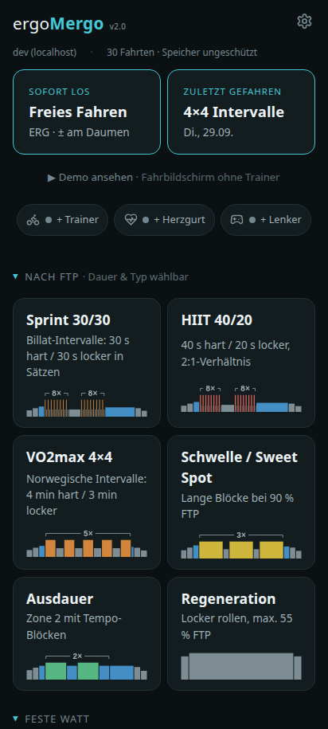
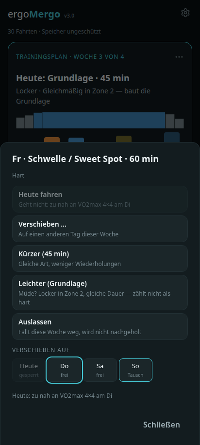
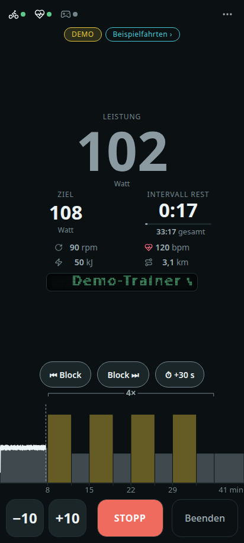
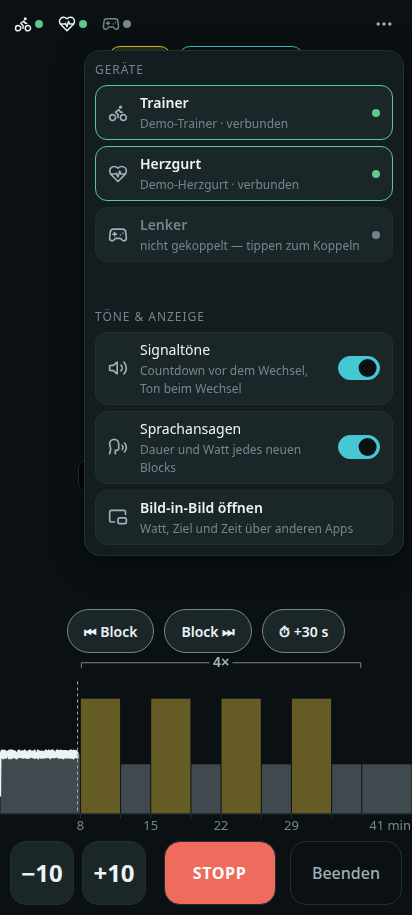
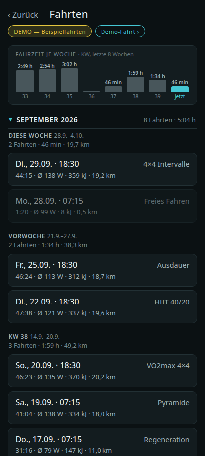
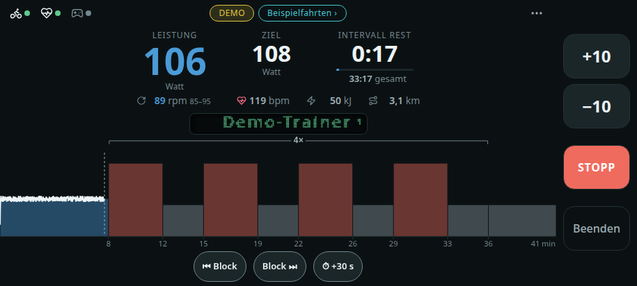

# ergoMergo

**Zwei Taps bis zum Treten.** ergoMergo macht aus einem Wahoo KICKR (oder jedem
FTMS-Smarttrainer) ein wattgesteuertes Ergometer — direkt im Browser, ohne Zwift,
ohne Abo, ohne Konto, ohne virtuelle Welt. Trainer per Bluetooth verbinden,
Programm oder Wattzahl wählen, fahren.

**Live:** https://grenzenloseschublade.github.io/ergoMergo/

  

## Datenschutz

**Die App schickt deine Daten nirgendwohin** — kein Server von uns, kein Konto,
keine Analyse, keine Cookies, keine fremden Bibliotheken. Fahrten (inklusive
Herzfrequenz), Einstellungen und Programme liegen nur im Browser auf deinem
Gerät. Eine Content-Security-Policy lässt den Browser Verbindungen nur zur
eigenen Adresse der App zu — selbst eingeschleuster Code könnte nichts an einen
fremden Server senden.

Ohne Netz läuft alles. Ist das Gerät online, fragt die App nur `sw.js` ab, um
Updates zu erkennen (beim Öffnen, beim Zurückkehren, alle 10 min — nie während
der Fahrt); GitHub als Hoster sieht dabei wie bei jedem Seitenaufruf IP-Adresse
und Zeitpunkt. Sicherung und TCX-Export entstehen nur auf deinen Tipp als Datei
auf deinem Gerät.

| Datenschutz-Etikett | |
|---|---|
| Vom Entwickler erhoben | nichts |
| An Dritte weitergegeben | nichts |
| Tracker / Werbung | keine |
| Berechtigungen | Bluetooth, nur für die im Chrome-Dialog gewählten Geräte |
| Speicherort | nur dein Browser (IndexedDB) |
| Löschen | jederzeit in der App bzw. über die Browserdaten |

Belegt durch eine automatische Selbstprüfung vor jeder Veröffentlichung —
Prüfkatalog, Speicher-Inventar, Grenzen und „So prüfst du es selbst":
[docs/sicherheit.md](docs/sicherheit.md). Funde bitte über [SECURITY.md](SECURITY.md) melden.

## Warum

Wer nur strukturiert Watt treten will, braucht keine 3D-Welt, kein Monatsabo und
keinen Account. Was fehlte: eine App, die den Trainer ansteuert wie ein
Studio-Ergometer — Ziel-Watt, Intervalle, ±-Tasten am Lenker, Auswertung.
ergoMergo ist genau das: eine einzige statische Web-App (Vanilla JS, Web
Bluetooth/FTMS, keine Buildkette, kein Backend), alle Daten bleiben lokal auf
dem Gerät.

| | | | | |
|---|---|---|---|---|
|  |  |  |  |  |



## Features

| Bereich | Was drin ist |
|---|---|
| ERG-Steuerung | Ziel-Watt mit sanften Rampen, ±-Tasten (Touch, Tastatur, Zwift Click/Ride), Not-Stopp mit geschütztem WEITER |
| Trainingsplan | Tage/Dauer/Ziel wählen, Wochen mit Aufbau und leichter Testwoche, heutige Einheit mit einem Tipp, verschieben/kürzer/leichter/auslassen mit Rückgängig |
| Programme | Zeitbasierte Generatoren (Sprint 30/30, HIIT 40/20, VO2max 4×4, Schwelle, Ausdauer, Recovery), klassische Programme, FTP-Rampentest, `.zwo`-Import (Einstellungen → Erweitert, standardmäßig aus) |
| Fahrbildschirm | Live-Graph mit Programmprofil und Positionscursor, Blocksteuerung (überspringen/zurück/+30 s), Kadenz-Zielbereiche, Fokus-Modus (Tap auf Werte oder Graph kippt die Gewichtung), LED-Statuszeile, Gerätezustand oben links, Bild-in-Bild (Experiment) |
| Ansagen & Töne | Countdown vor jedem Wechsel, unterscheidbare Signale für härter/leichter (Dur-Dreiklang rauf bzw. Töne abwärts), Sprachansagen aus vorgerenderten Audio-Bausteinen — funktionieren auch mit Bildschirm aus |
| Geräte | Trainer, Herzfrequenz-Gurt, Zwift Click/Ride; Tasten frei belegbar per Lern-Modus; Schnellverbindung ohne Geräteauswahl (mit Chrome-Flag) |
| Auswertung | Dauer, Ø/max/NP, IF/TSS, HF, Distanz (aus Trainer-Speed integriert, im ERG-Modus gangabhängig), Zeit in Zonen, Soll/Ist-Vergleich pro Block, Wochenbilanz, TCX-Export, Akkuverbrauch pro Fahrt |
| Plattform | Installierbare PWA, offlinefähig, alles lokal in IndexedDB — kein Server, keine Cloud; Demo-Modus ohne Trainer (Button auf dem Startbildschirm) |

## Neu in 3.4.2

- **Neuer Auftakt „wuchtig“:** zwei schwere Schläge mit langem Nachhall.
  Ansagen und Signaltöne folgen, sobald er hörbar verklungen ist.
- **Tastenbelegung auf einer Seite:** Das Blatt in der Fahrt und der
  Lern-Modus passen ohne Scrollen auf den Bildschirm. Die Ansicht zeigt nur
  die belegten Tasten, „Als Liste ›“ schaltet zwischen Lenker und Liste um.
- **Lern-Modus übersichtlicher:** „Schritt 1 von 5“, darunter die Aktion in
  einer Zeile; die gewählten Tasten sind direkt am Lenker markiert, nichts
  springt mehr zwischen den Schritten.

## Neu in 3.4.1

- **Plan-Karte kompakter:** Über dem Profil steht nur noch so viel Platz, wie
  der längste Text dieser Woche braucht; beim Tippen auf andere Tage springt
  weiterhin nichts.
- **Auftakt auch in der Demo**, wenn sie über den Demo-Knopf startet.

## Neu in 3.4

- **Auftakt:** Zum Start der Fahrt erklingen zwei schwere Schläge (eigene
  Klangsynthese, kein Sample). Erst danach kommen Ansagen und Signaltöne.
- **Lenker:** Watt hoch und runter lassen sich auf mehrere Tasten legen. Ab
  Werk: beide Paddles nach außen = mehr Watt, nach innen = weniger. Im
  Lern-Modus einfach mehrere Tasten drücken, dann „Weiter“.
- **Ruhigeres Halten:** Gehaltene Tasten und Paddles zählen in einem festen,
  wählbaren Takt (ruhig, normal, flott) statt viel zu schnell.
- **Unbelegte Tasten** geben einen eigenen, tiefen Doppel-Tick.
- **Tastenbelegung in der Fahrt:** im Menü „⋯“ zum Nachsehen.
- **Bild-in-Bild:** Knopf direkt oben in der Fahrt. Das Fenster zeigt den
  Stopp, das Ziel des nächsten Blocks und einen kleinen Pfeil, wenn die
  Trittfrequenz zu niedrig (↑) oder zu hoch (↓) ist.
- **Trittfrequenz im Ziel** färbt sich leicht, im Fahrbildschirm und im
  Bild-in-Bild.
- **Pulsgrenze** (Einstellungen, Standard aus): ab diesem Puls wird der Wert
  in der Fahrt rot. Das Herzsymbol ist sonst neutral wie die anderen.
- **Bildschirm bleibt an:** Verweigert das Handy das (z. B. im
  Energiesparmodus), sagt die App es einmal in der Statuszeile.
- **Plan-Karte springt nicht mehr** beim Tippen auf einen freien Tag.
- **Diagnose-Log** hält Bildschirm-, Bild-in-Bild- und Audiozustand sowie das
  Fahrtende fest (ohne Puls- oder Leistungsdaten).

## Neu in 3.3.1

- **„Nur auf diesem Gerät ›“** steht jetzt sichtbar oben auf dem
  Startbildschirm. Ein Tipp erklärt in drei Sätzen, was mit deinen Daten
  passiert, mit Link zum Prüfbericht.
- **Verständlich statt „Speicher ungeschützt“:** Hebt der Browser die
  Fahrten noch nicht dauerhaft auf, steht dort „nicht dauerhaft gespeichert ›“
  samt Erklärung und Abhilfe (App installieren oder Sicherung speichern).
- **Ein Tipp daneben schließt** Blätter und den Startdialog. Einstellungen und
  Plan-Dialog bleiben offen, damit keine Eingabe verloren geht.

## Neu in 3.3

- **Datenschutz & Sicherheit nachweisbar:** Eine Content-Security-Policy
  lässt die App nur von ihrer eigenen Adresse laden und nur dorthin
  verbinden. Jede Netzstelle im Code ist begründet freigegeben, ein
  Netz-Mitschnitt aller Abläufe belegt es
  ([docs/sicherheit.md](docs/sicherheit.md), [SECURITY.md](SECURITY.md)).
- **Veröffentlichung nur nach bestandenen Prüfungen** per GitHub Actions,
  ausgeliefert werden nur die App-Dateien.
- **Einstellungen → „Datenschutz & Sicherheit“:** kurz erklärt, was die App
  tut, Link zum Prüfbericht und „Alle Daten löschen“ (mit Rückfrage).
- Trainingsplan rechnet bei der Zeitumstellung richtig (Planende und Tage
  ohne Fahrt nach Kalendertagen); die Update-Prüfung ruht während der Fahrt.

## Neu in 3.2

- **Plan-Karte wie ein Kalender:** Tag im Wochenstreifen antippen zeigt
  dessen Einheit bzw. die gefahrene Fahrt. Leise Aktionen darunter:
  „Starten ›“ (heute), „Heute fahren ›“ (späterer Tag — legt die Einheit auf
  heute und startet; gesperrt mit Grund, Abbrechen nimmt es zurück),
  „Fahrt ansehen ›“ (gefahren) und „Ändern“.

## Neu in 3.1

- **Plan-Länge** wählbar: 4, 8 oder 12 Wochen oder fortlaufend; am Ende eine
  Bilanz mit „4 Wochen weiter“ oder „Neuer Plan“. Die Karte zeigt „Woche 3 von 8“.
- **Pausieren** ohne Grund; beim Fortsetzen richtet sich der Einstieg nach
  der Pausenlänge (nahtlos · Woche wiederholen · leichte Woche mit FTP-Test ·
  Neubeginn). Nach 7 Tagen ohne Fahrt bietet die Karte das selbst an.
- **Planfahrten sichtbar:** Marke „Plan“ in der Fahrtenliste, „(2 im Plan)“
  im Wochenkopf, in der Detailansicht „Trainingsplan · Woche 3 von 8 ·
  Intervalle“ — auch „statt …“, wenn frei an einem Plantag gefahren wurde.
- Eine abgebrochene Planfahrt (unter 15 min, FTP-Test unter 5 min) gilt nicht
  mehr als erledigt.

## Neu in 3.0

- **Trainingsplan:** Wochentage, Dauer (30/45/60 min) und Ziel (Fitness,
  Leistung, Ausdauer) wählen — die App stellt jede Woche zusammen. Höchstens
  zwei harte Einheiten mit Ruhetag dazwischen, 4-Wochen-Blöcke mit leichter
  Woche und FTP-Rampentest, ohne bekannte FTP zuerst der Test. Auf Home steht
  „Heute: …" (ein Tipp startet die Einheit) und ein Wochenstreifen in
  Zonenfarben. Grundlagen und Quellen: [docs/trainingsplan.md](docs/trainingsplan.md).
- **Einheiten ändern:** Tag im Wochenstreifen antippen — heute fahren,
  verschieben (belegter Tag = Tausch; zu nah an einer harten Einheit =
  gesperrt, mit Grund), kürzer, leichter, auslassen. Jede Änderung lässt sich
  rückgängig machen. Verpasste harte Einheiten wandern automatisch auf den
  nächsten passenden Tag; eine harte Fahrt außerhalb des Plans zählt mit.
- **Design-System:** Farben, Schrift, Radien, Abstände nur noch aus
  `css/tokens.css`; lebendiger Style Guide
  ([docs/stil.html](https://grenzenloseschublade.github.io/ergoMergo/docs/stil.html)),
  eine Prüfung verhindert feste Werte. Alle Tippflächen ≥ 44 px.
- **`.zwo`-Import** ist jetzt eine Einstellung (Erweitert), standardmäßig aus.
- **Tests im Repo:** `npm test` prüft Stil, Plan-Regeln (alle
  Wochentag-Kombinationen, Verpass-Muster, Verschiebungen), Abläufe und
  Layout.

## Neu in 2.0

- **Fahrbildschirm aufgeräumt:** Oben links zeigen drei Symbole mit Punkt den
  Zustand von Trainer, Herzgurt und Lenker; ein Tipp verbindet oder koppelt.
  „⋯" oben rechts öffnet ein Panel mit den Geräten im Klartext (Name, Zustand,
  was ein Tipp bewirkt), Signaltönen, Sprachansagen und Bild-in-Bild. Das Panel
  sperrt nichts: STOPP und ± bleiben daneben sofort bedienbar.
- **LED-Statuszeile:** Meldungen der Fahrt (Block übersprungen, Gerät getrennt,
  Not-Stopp …) laufen als Punktmatrix-Laufschrift durch eine feste Mulde statt
  als Toast — nichts springt, nichts verdeckt.
- **Ruhiges Layout:** Feste Feldbreiten und ein festes Raster für die
  Detailwerte (hochkant 2×2, quer 4 nebeneinander); in allen Ausrichtungen und
  Fokus-Modi geprüft, dass nichts springt und STOPP immer im Bild ist.
- **Fahrten-Historie:** Eigener Screen mit Monaten und Wochensummen,
  Detail-Graph mit Herzfrequenz, Zielblöcken und Not-Stopp-Streifen.
- **Demo:** Beispielfahrten direkt aus der Demo-Fahrt erreichbar, mit Rückweg.

## Getestet mit

| Gerät | Firmware/Version |
|---|---|
| Wahoo KICKR CORE 2 | FW 3.5.37 |
| Zwift Ride (Lenker) | FC82-Firmware (ab Jan 2025), Lern-Modus für Tastenbelegung |
| Samsung-Smartphone, Android-Chrome | Primärziel (Handy am Lenker) |
| Ubuntu-Laptop, Chrome | Sekundärziel |

Jeder FTMS-Trainer sollte funktionieren (Standard-Protokoll); getestet ist die
Kombination oben. iOS wird nicht unterstützt (kein Web Bluetooth in Safari).

## Nutzung

- **Android:** Seite öffnen bzw. als App installieren, Trainer auswählen, fahren.
  Den Trainer **nicht** vorab in den Android-Bluetooth-Einstellungen koppeln —
  das blockiert die Verbindung aus der App.
- **Linux:** Web Bluetooth hinter Flag: `chrome://flags/#enable-web-bluetooth`
  aktivieren. Scheitert das Pairing, den Trainer einmalig per `bluetoothctl`
  koppeln (`pair` + `trust`).
- Optional überall: `chrome://flags/#enable-web-bluetooth-new-permissions-backend`
  erspart die Geräteauswahl bei jedem Start (Schnellverbindung).

## Workouts nach Zeit & Typ

Dauer und Trainingstyp wählen — die App generiert ein vollständiges Programm mit
Warmup-Rampe, skaliertem Hauptteil und Cooldown. Intensitäten sind fix (%FTP),
die Zeit skaliert über Wiederholungen und Z2-Füller. Ohne FTP-Wert wird 170 W
angenommen. Kein Tabata, keine 10-s-Sprints: ERG braucht 2–6 s pro
Sollwertwechsel, kürzere Intervalle wären überwiegend Rampe.
Strukturen, Formeln und Quellen: [docs/programme.md](docs/programme.md)

## Daten & Speicherung

Alle Daten liegen **lokal** in einer IndexedDB (`ergomergo`) im Chrome-Profil —
kein Server, kein Konto, keine Cloud. Stores: `sessions` (Kennwerte je Fahrt),
`sessionData` (Rohsamples 1/s), `settings`, `programme`, `logs` (Diagnose).
`navigator.storage.persist()` schützt vor automatischem Aufräumen. Sicherung:
Komplett-Backup als JSON (Einstellungen → Sicherung) und TCX-Export je Fahrt.

## Geräte & schnelles Starten

Einmal verbundene Geräte (Trainer, HF-Gurt, Zwift Click/Ride) werden gemerkt;
mit persistenten Web-Bluetooth-Berechtigungen verbindet die App beim Start ohne
Geräteauswahl, HF-Gurt und Controller automatisch mit. Zwift-Ride-Tasten werden
in Einstellungen → Geräte → „Tasten zuordnen" interaktiv belegt (+/−, Block
vor/zurück, STOPP), je Aktion auch mehrere Tasten; ist von einem Paddle nur
eine Richtung belegt, wirkt es in beide. Ab Werk: Watt hoch = beide Paddles
nach außen, Watt runter = beide nach innen, Block vor/zurück = Pfeil
rechts/links, STOPP = B. Die rpm-Anzeige kommt direkt vom Trainer (der KICKR schätzt
die Trittfrequenz selbst, kein externer Sensor nötig).

## Firmware

Die App liest die Trainer-Firmware aus (Geräteliste, Diagnose-Log). Updates
macht sie nicht — es gibt kein öffentliches Protokoll: der KICKR CORE 2
aktualisiert über WLAN/Wahoo-App, Zwift Ride/Click über die Companion-App.
Ride-Firmware ab Jan 2025 wechselt die BLE-Service-UUID auf `FC82` — die App
unterstützt beide Varianten. Fehlersuche: [docs/debugging.md](docs/debugging.md)

## Entwicklung

```sh
python3 -m http.server 8000
# http://localhost:8000 — localhost ist Secure Context, HTTPS lokal nicht nötig.
```

Dev-Parameter: `?demo=<workoutId>` (z. B. `?demo=vo2max` — Demo-Fahrt ohne
Trainer), `?demo` (freies Fahren); alle Parameter in
[docs/debugging.md](docs/debugging.md). Test vom Android-Gerät:
GitHub-Pages-Deployment oder USB-Debugging + `chrome://inspect`.

### Stil und Tests

Farben, Schriftgrößen, Radien und Abstände kommen nur aus `css/tokens.css`
(Regeln: [docs/stil.md](docs/stil.md), alle Bausteine live:
[docs/stil.html](https://grenzenloseschublade.github.io/ergoMergo/docs/stil.html)).

```sh
node tools/stil-check.mjs   # feste Werte außerhalb der Tokens (läuft auch in release.mjs)
node tools/datenschutz-check.mjs  # jede Netzstelle freigegeben, CSP unverändert (läuft auch in release.mjs)
node test/sicherheit.mjs    # präparierte Sicherung: kein Schadcode, bereinigt
node test/netz.mjs          # Netz-Mitschnitt aller Abläufe inkl. Service Worker, CSP, Speicher
node test/layout.mjs        # Fahrbildschirm in 5 Größen: Bedienleiste, Überlauf, Zentrierung, Sprünge, Panel
node test/ablauf.mjs        # Navigation, Einstellungen, Fahrt, Programm, Demo-Wege mit Sollwerten
```

Die Browser-Tests brauchen Node ≥ 22 und ein Chrome (`CHROME=/pfad/zu/chrome`,
sonst Playwrights `chrome-headless-shell` oder `google-chrome`); sie starten
ihren eigenen Server.

### Release

Der Versionsstempel steht doppelt (`VERSION` in `sw.js` für die
Update-Erkennung, `APP_VERSION` in `js/version.js` für den
Install-Konsistenz-Check) — laufen sie auseinander, bricht jede
Service-Worker-Installation ab. Deshalb ausschließlich über das Skript bumpen:

```sh
node tools/release.mjs            # nächste Version, setzt beide Stempel
node tools/release.mjs --check    # prüft vor dem Push auf Drift
```

Danach committen (Konvention: „…; Release vXX") und pushen. Der Workflow
`.github/workflows/pages.yml` prüft (Stil, Datenschutz, Sicherheit, Netz) und
veröffentlicht nur die App-Dateien aus `tools/auslieferung.mjs`; installierte
Apps bieten das Update per Button an.

### Diagnose-Log vom Gerät ziehen

`tools/log-pull.mjs` holt das Diagnose-Log und die Fahrtdaten direkt aus der
IndexedDB der App auf dem Android-Gerät — ohne Export in der App. Es nutzt
`adb forward` auf den Chrome-DevTools-Socket und das DevTools-Protokoll.
Voraussetzungen: USB-Debugging, Chrome mit offenem ergoMergo-Tab, Node ≥ 22.

```sh
node tools/log-pull.mjs                    # Log anzeigen + Komplett-Dump als JSON
node tools/log-pull.mjs --logs-only        # nur das Log
node tools/log-pull.mjs --seit 2026-09-21  # Log ab Datum
```

## Lizenz

MIT
